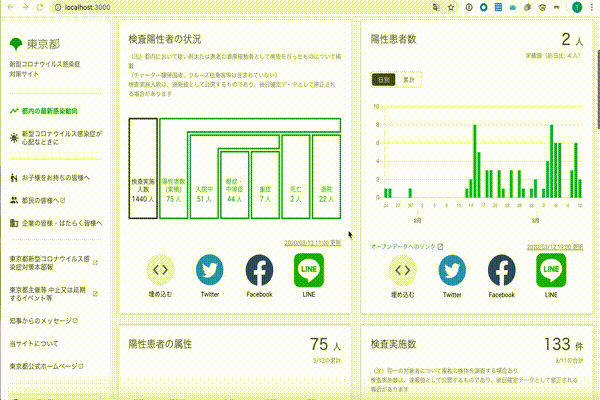

# Demo for Tokyo COVID-19 Task Force website

This site is demo site for tokyo covid-19.


## For Mapbox Setup



### How to Set Up Environments

- Required Node.js version: 10.19.0 or higher

**Use mapbox gl vue**
``` bash
yarn add mapbox-gl-vue
```

https://www.npmjs.com/package/mapbox-gl-vue


**Use yarn**
``` bash
# install dependencies
$ yarn install

# serve with hot reload at localhost:3000
$ yarn dev

# or you many need to add token for Mapbox
ACCESS_TOKEN=yourAccessToken yarn dev
```

**Use docker**
```bash
# serve with hot reload at localhost:3000
$ docker-compose up --build
```

### How to resolve `Cannot find module ****` error

**Use yarn**
```
$ yarn install
```

**Use docker**
```bash
$ docker-compose run --rm app yarn install
```

---

[Tokyo COVID-19 Task Force website](https://stopcovid19.metro.tokyo.lg.jp/)

[日本語](./README.md) | English | [Spanish](./README_ES.md) | [Korean](./README_KO.md) | [Chinese (Taiwan)](./README_ZH_TW.md) | [Chinese (Simplified)](./README_ZH_CN.md) | [Vietnamese](./README_VI.md)


## Code of Conduct

Please check [Code of conduct for developers](./.github/CODE_OF_CONDUCT_EN.md) for details.

## License
This software is released under [the MIT License](./LICENSE.txt).
